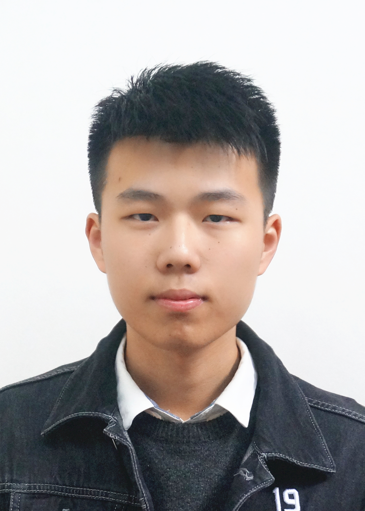

## Welcome to GitHub Pages

# Ziyi Liu(刘子毅）

## 教育经历：
[武汉理工大学](http://www.whut.edu.cn/) 数学基地班(2017.9-2021.6)
- GPA:4.313/5
- 专业排名：2/89;前2.25%
### 已修机器学习相关课程：
- 数学类：
数学分析   高等代数   概率论与数理统计   随机过程   泛函分析   实变函数   复变函数   常微分方程   点集拓扑   微分几何   数值分析  模式识别   数据挖掘    数学物理方程   近世代数   统计计算与机器学习   离散数学   数学模型
- 计算机类： 
面向对象程序设计   数据结构与算法    C高级程序设计 实用计算方法与软件
## 获奖情况：
- 2019年美国大学生数学建模竞赛Meritorious Winner
- 2019年MathorCup数学建模竞赛二等奖
- 2019年CCF CSP专业组认证210分
- 2019年校三好学生
- 2018年华中地区数学建模竞赛三等奖
- 2018年校三好学生
## 个人技能
- 语言：
普通话   英语(CET-4、CET-6)
- 编程：
C++、Python、Matlab
- 深度学习框架：
Pytorch  Tensorflow
## 研究兴趣：
- 深度学习泛化理论
- 无监督学习
- 强化学习
- 计算机视觉
- 信息检索

## 科研经历

